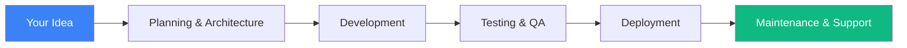

<div align="center">

# 💫 Full Stack Developer


### 🌐 Frontend Architect • ⚡ Backend Engineer • 📱 Mobile Developer

</div>

---

## 🎯 What I Do

I transform ideas into production-ready applications. From pixel-perfect interfaces to robust server architectures, I build end-to-end solutions that scale. Whether it's a responsive web app, a native mobile experience, or a complex backend system—I've got you covered.

```typescript
const developer = {
  name: "Full Stack Developer",
  focus: ["Web", "Mobile", "API Design"],
  currentlyLearning: "Advanced system design patterns",
  challenge: "Building apps that handle millions of users",
  goal: "Create software that makes a difference"
};
```

---

## 🔥 Core Technologies

<table align="center">
<tr>
<td align="center" width="50%">

### Frontend Development
```javascript
const frontend = {
  frameworks: ['React', 'Next.js', 'React Native'],
  languages: ['TypeScript', 'JavaScript (ES6+)'],
  styling: ['Tailwind CSS', 'Material UI', 'Bootstrap'],
  state: ['Redux', 'Context API', 'Zustand'],
  tools: ['Vite', 'Webpack', 'Babel']
}
```

</td>
<td align="center" width="50%">

### Backend Development
```javascript
const backend = {
  runtime: ['Node.js'],
  frameworks: ['Express.js', 'NestJS'],
  databases: ['MongoDB', 'PostgreSQL', 'Redis'],
  apis: ['RESTful', 'GraphQL', 'WebSocket'],
  auth: ['JWT', 'OAuth 2.0', 'Passport.js']
}
```

</td>
</tr>
</table>

---

## 💼 Tech Arsenal

<div align="center">


</div>

---

## 🎨 What Makes Me Different

<table>
<tr>
<td width="25%" align="center">

### ⚡ Speed
Fast development cycles with production-grade quality

</td>
<td width="25%" align="center">

### 🎯 Precision
Pixel-perfect UIs that match your vision exactly

</td>
<td width="25%" align="center">

### 🔄 Full Cycle
From concept to deployment, I handle it all

</td>
<td width="25%" align="center">

### 🚀 Modern Stack
Always using cutting-edge, industry-standard tech

</td>
</tr>
</table>

---

## 🌟 My Approach



**1. Understanding** → Deep dive into requirements  
**2. Architecture** → Scalable system design  
**3. Development** → Clean, maintainable code  
**4. Testing** → Rigorous quality assurance  
**5. Deployment** → Smooth production rollout  
**6. Support** → Ongoing optimization  

---

## 📊 GitHub Statistics

<div align="center">
  
  
</div>

<div align="center">
  
</div>

---

## 🏗️ Project Showcase

<div align="center">

| 🎯 Project Type | 💡 Technologies | 🚀 Highlight |
|----------------|----------------|--------------|
| **E-Commerce Platform** | Next.js, Node.js, MongoDB | Real-time inventory, payment integration |
| **Social Mobile App** | React Native, Express, PostgreSQL | 50K+ active users, push notifications |
| **SaaS Dashboard** | React, TypeScript, AWS | Analytics, multi-tenant architecture |
| **Booking System** | Next.js, Node.js, Redis | Real-time availability, automated workflows |

</div>

---

## 🎓 Development Philosophy

> "Great software is built on three pillars: **Performance**, **Scalability**, and **User Experience**. I never compromise on any of them."

- ✅ Write code that others can understand
- ✅ Build systems that can grow
- ✅ Design experiences users love
- ✅ Deploy solutions that just work
- ✅ Communicate clearly, deliver consistently

---

## 🤝 Let's Connect

<div align="center">

[](YOUR_LINKEDIN)
[](YOUR_PORTFOLIO)
[](mailto:YOUR_EMAIL)
[](YOUR_TWITTER)

</div>

---

## 💡 Quick Facts

```yaml
current_focus:
  - Building scalable microservices
  - Optimizing React Native performance
  - Exploring AI integration in web apps

availability: Open to exciting projects
location: Available for remote collaboration
response_time: Usually within 24 hours
```

---

<div align="center">

### 📈 Profile Analytics


### 💬 Ready to Build Something Amazing?

**Let's turn your vision into reality. Reach out today!**

---

⭐ *If you find my work valuable, consider starring some repos!* ⭐

</div>
